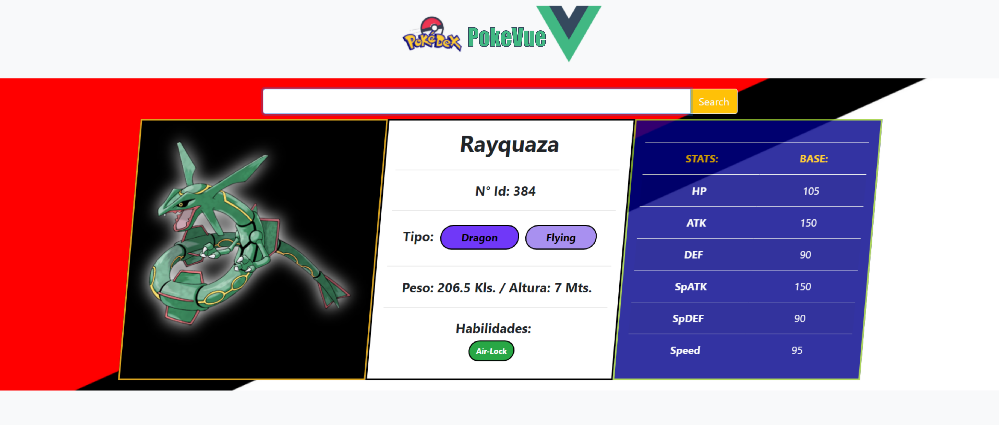

# PokeVue

## :computer: Setup
```
npm install
```

## :desktop_computer: Sever

```
npm run serve
```

### :arrow_double_up: Produção
```
npm run build
```

### :ballot_box_with_check: Lints
```
npm run lint
```


# PokeVue
[VueJs](https://vuejs.org/)